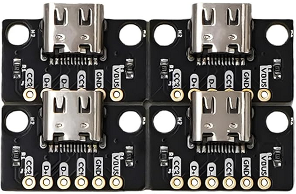
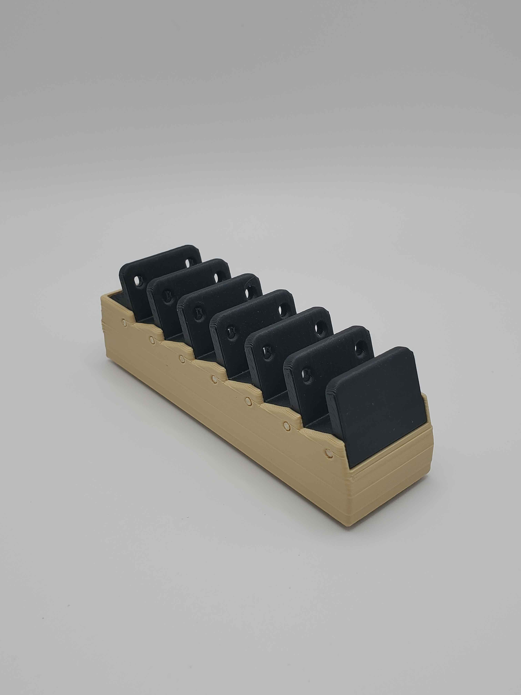
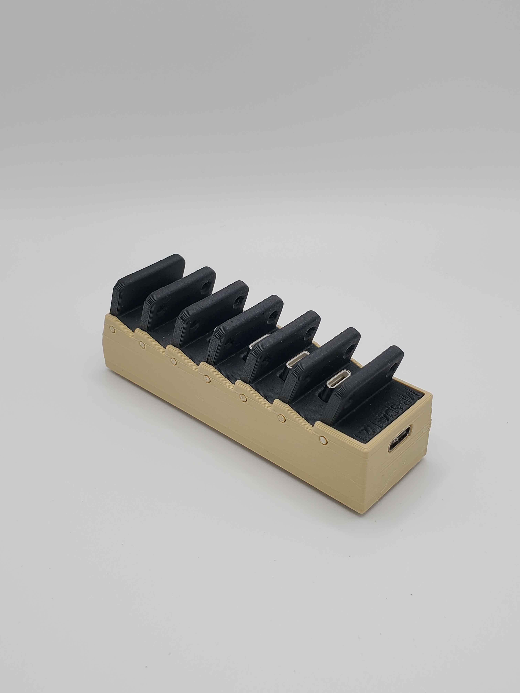
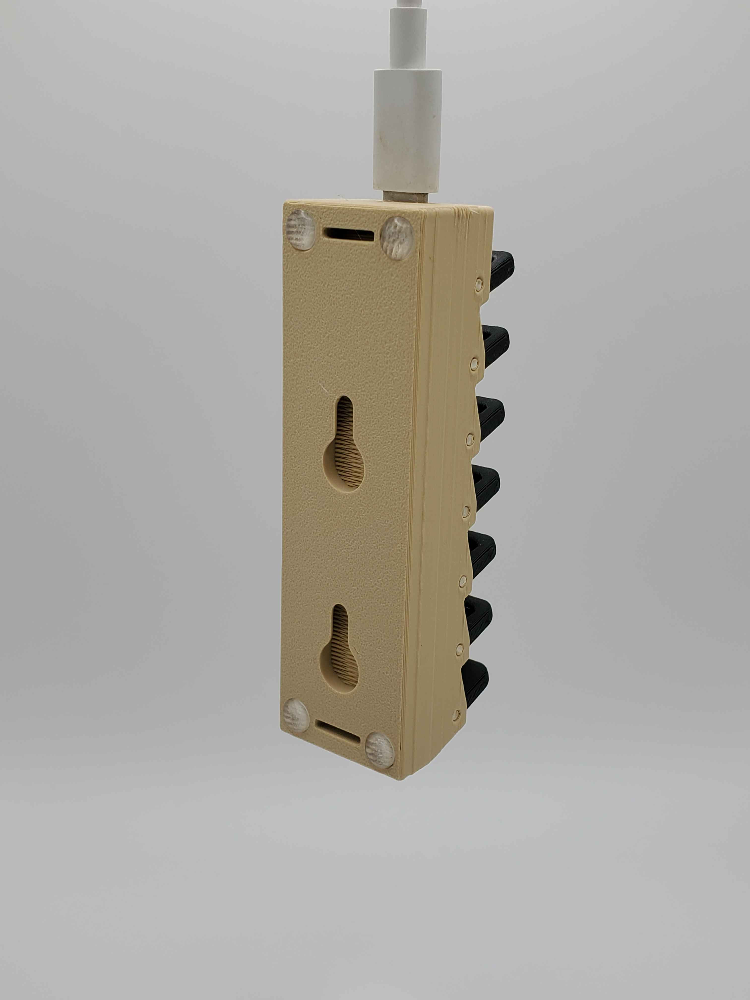
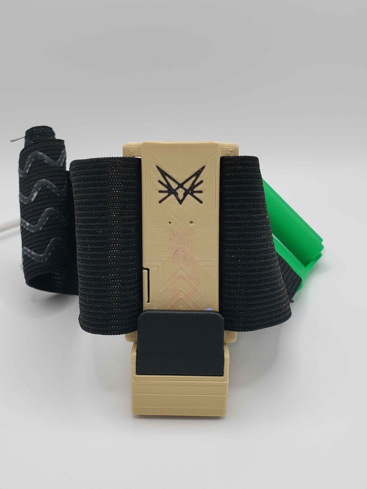

## Charging dock
Currently this repo only contains the files for a dock with 6 trackers. Due to technical limitations I can't provide a parametric file. I will add 5,6,7,8,9,& 10 docks later.\
If you want a dock with # of trackers that isn't included here, feel free to [contact me on discord](https://discord.gg/vpxSHmUSXH) for the files.\
Spots for rubber feet fit standard 6mm adhesive non-slip rubber feet.\
Wall mounts are for generic 1¼" drywall screws.\
Uses [Treedix USB Type-C Breakout Board](https://www.amazon.ca/gp/product/B096M2HQLK) as the USB C input. This isn't a custom PCB because only one is required per dock, it's cheaper to order these than a custom pcb in small quantities.\

\

* The .3mf is for Orca Slicer. I print with a Bambu Labs P1S.

 \
 \