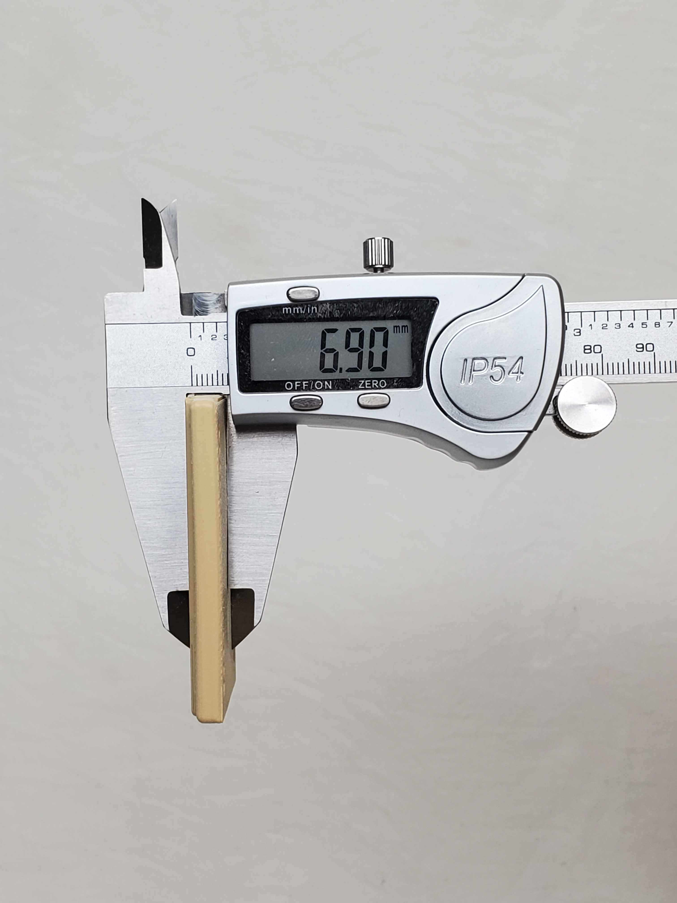
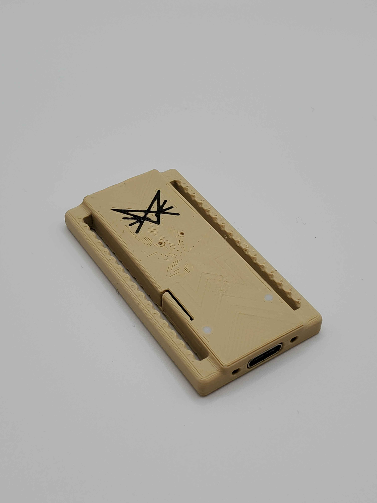
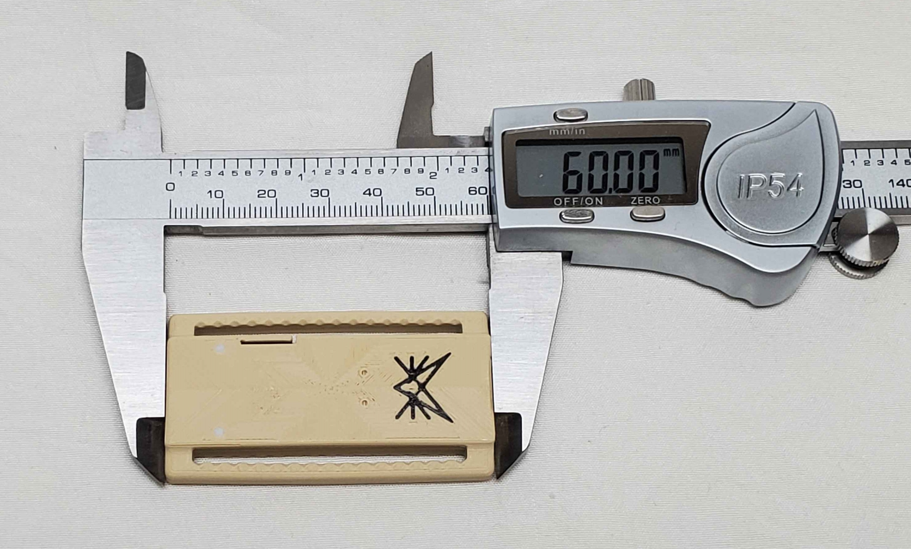
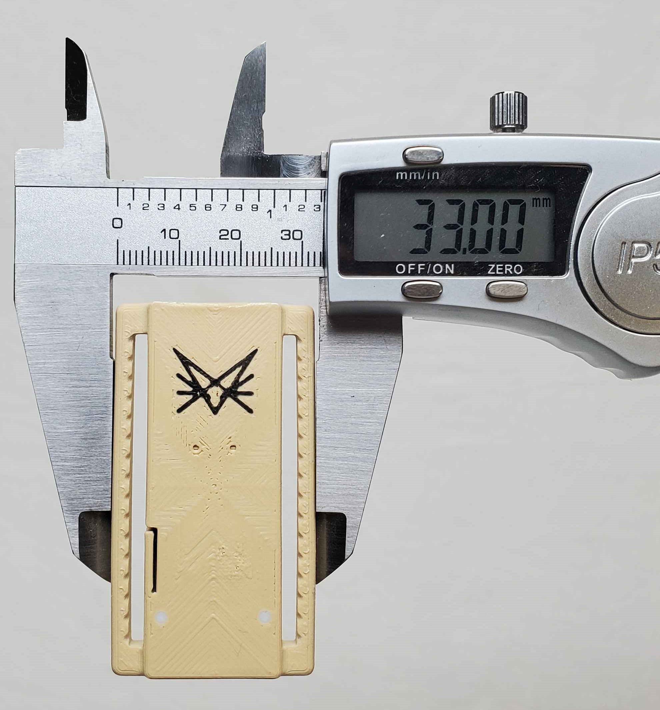

## some things to take note of!
These are pretty hard to print compared to the receiver case. I recommend looking at the .3mf file. A multi-material printer with at least 2 materials is required for the light diffuser to function.
0.12mm layer height
Layer height modifier required to print properly
Thick bridges ON
* The .3mf is for Orca Slicer. I print with a Bambu Labs P1S.

